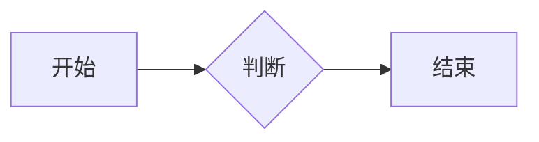
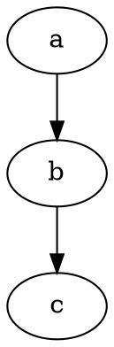

# The Best and Most Efficient Blog

一个双语（中文 / English）、纯静态、Markdown 驱动的轻量级技术博客。基于 **Next.js 16 App Router** 构建，通过 `output: "export"` 导出为纯静态文件，部署在 **Cloudflare Pages**。

> 在线地址：<https://newblog.wunai.top>

---

## 目录

- [核心特性](#核心特性)
- [技术栈](#技术栈)
- [目录结构](#目录结构)
- [快速开始](#快速开始)
- [写作指南](#写作指南)
  - [文章 Frontmatter](#文章-frontmatter)
  - [短代码](#短代码)
  - [图表与可视化](#图表与可视化)
  - [数学与化学公式](#数学与化学公式)
- [站点配置](#站点配置)
- [构建产物与脚本](#构建产物与脚本)
- [部署](#部署)
- [性能与可访问性](#性能与可访问性)
- [常见问题](#常见问题)
- [许可](#许可)

---

## 核心特性

**内容**

- Markdown 写作，YAML（`---`）或 TOML（`+++`）两种 frontmatter 均可
- GitHub Flavored Markdown：表格、任务列表、删除线、自动链接
- 代码高亮（highlight.js，monokai 主题）
- KaTeX 数学公式，内置 `mhchem` 化学式扩展与自定义宏
- 五类图表：Mermaid 流程图、ECharts 数据图、Graphviz DOT 图、abc.js 乐谱、SmilesDrawer 化学结构式
- 参考文献区（frontmatter `references`）+ 正文角标引用 `[reference:N]`
- 中文排版自动优化：CJK 与半角字符之间自动加空格、中文标点自动转换
- 站内搜索（Fuse.js，构建期预生成索引，零运行时后端）
- RSS 订阅、站点地图、robots.txt、PWA（Service Worker + 离线页）

**阅读体验**

- 深色 / 浅色 / 跟随系统三态主题，`localStorage` 持久化且首屏无闪烁
- 7 档正文字号调节
- 动态可互动背景（点网格：点被光标 / 触点推开后自行回弹，明暗主题自适应，详见[性能与可访问性](#性能与可访问性)）
- 文章目录、阅读进度、滚动定位、回到顶部
- 打印 / 另存为 PDF（专用 `@media print` 样式），一键下载 Markdown 原文
- 评论区（giscus，滚动到可见区域才加载）
- 路由切换过渡动画、元素入场动画，完整支持 `prefers-reduced-motion`
- 中英双语路由与语言切换

---

## 技术栈

| 分类 | 选型 |
| --- | --- |
| 框架 | Next.js 16.3（App Router，`output: "export"` 静态导出） |
| UI | React 19.2、Tailwind CSS 4（`@tailwindcss/postcss`）+ 自定义 `globals.css` |
| 语言 | TypeScript 5 |
| Markdown | unified / remark（parse、gfm、math、breaks）+ rehype（raw、highlight、katex、slug、autolink、stringify） |
| 公式 | KaTeX 0.16 + `katex/contrib/mhchem` |
| 检索 | Fuse.js 7 |
| 图标 | Iconify（`@iconify/react/offline` + `@iconify/icons-mdi`，离线打包，无运行时请求） |
| 评论 | giscus（GitHub Discussions） |
| 部署 | Cloudflare Pages（wrangler + GitHub Actions） |

> 说明：Mermaid / ECharts / Graphviz / abc.js / SmilesDrawer 均在页面出现对应图表时才从 jsDelivr CDN 按需加载，不进入主包。

---

## 目录结构

```
.
├── .github/
│   └── workflows/deploy.yml        # 推送到 main/master 自动构建并发布到 Cloudflare Pages
├── my-app/                         # Next.js 应用主体
│   ├── app/
│   │   ├── layout.tsx              # 根布局：元数据、主题引导脚本、SVG 滤镜、动态背景、SW 注册
│   │   ├── globals.css             # 全部样式：主题变量、动画引擎、组件样式、打印样式
│   │   ├── page.tsx                # 根路径，重定向到 /zh/
│   │   ├── not-found.tsx
│   │   ├── robots.ts / sitemap.ts  # 静态生成的 robots 与 sitemap
│   │   └── [lang]/                 # zh | en 双语路由
│   │       ├── layout.tsx          # Header + main + Footer
│   │       ├── page.tsx            # 首页（置顶文章 + 文章列表）
│   │       ├── posts/page.tsx      # 文章列表
│   │       ├── posts/[slug]/page.tsx  # 文章详情（正文、TOC、上下篇、评论、JSON-LD）
│   │       ├── tags/、categories/  # 标签 / 分类索引与详情
│   │       ├── archives/           # 按年份归档
│   │       └── search/             # 站内搜索
│   ├── components/
│   │   ├── InteractiveBackground.tsx  # 点网格交互背景（Canvas）
│   │   ├── PostBody.tsx            # 正文渲染 + 复制按钮 + 图表按需加载
│   │   ├── Header.tsx / Footer.tsx / PostCard.tsx / PostNav.tsx
│   │   ├── ThemeToggle.tsx / FontSizeControl.tsx / LangSwitcher.tsx
│   │   ├── Comments.tsx / PrintControls.tsx / Search.tsx / RouteLoading.tsx
│   ├── content/                    # 站点内容
│   │   ├── zh/posts/*.md
│   │   └── en/posts/*.md
│   ├── lib/
│   │   ├── content.ts              # 文章读取、frontmatter 解析、排序、聚合
│   │   ├── markdown.ts             # unified 渲染管线、短代码、TOC 提取
│   │   ├── site.ts                 # 站点配置与 i18n 文案（客户端安全）
│   │   └── icons.ts                # Iconify 图标集合
│   ├── public/                     # 静态资源（含构建期生成的搜索索引与 RSS）
│   ├── scripts/
│   │   ├── generate-search-index.mjs  # 生成 search-index.{zh,en}.json
│   │   └── generate-rss.mjs           # 生成 rss.xml
│   ├── next.config.ts              # 静态导出、trailingSlash
│   ├── wrangler.toml               # Cloudflare Pages 项目配置
│   └── package.json
└── README.md
```

---

## 快速开始

### 环境要求

- Node.js **20+**（CI 使用 20）
- npm（仓库包含 `package-lock.json`）

### 本地开发

```bash
cd my-app
npm ci          # 或 npm install
npm run dev     # http://localhost:3000
```

> `dev` 模式不会执行 `prebuild`，因此搜索索引与 RSS 用的是仓库里已有的 `public/` 产物。新增文章后想在本地点验搜索，先跑一次 `npm run prebuild`。

### 构建与本地预览

```bash
cd my-app
npm run build       # 自动先执行 prebuild，产物在 my-app/out/
npx serve out       # 或任意静态服务器
```

### 代码检查

```bash
cd my-app
npm run lint
```

---

## 写作指南

文章放在 `my-app/content/<lang>/posts/` 下，文件名即 URL slug（中文文件名会被 URL 编码）。`_index.md` 会被忽略，`draft: true` 的文章不会进入任何列表与索引。

### 文章 Frontmatter

YAML 写法：

```markdown
---
title: 文章标题
date: 2026-08-02
author: wunai
tags: [数学, 笔记]
categories: [学习]
summary: 列表页与搜索结果显示的摘要
pinned: false
showToc: true
---

正文……
```

TOML 写法（`+++` 包裹，字段名相同，用 `=` 赋值）同样支持。

| 字段 | 类型 | 说明 |
| --- | --- | --- |
| `title` | string | 标题，缺省时使用文件名 |
| `date` | date | `YYYY-MM-DD`，用于排序、归档与 sitemap `lastModified` |
| `author` | string | 作者。填 `AI`（不区分大小写）会标记为 AI 生成、展示警示徽章，并在列表中排在人类文章之后 |
| `tags` | string[] | 标签，生成标签页与标签云 |
| `categories` | string[] | 分类 |
| `summary` | string | 摘要，缺省时截取正文前 120 字 |
| `description` | string | 更长的描述，用于元信息 |
| `pinned` | bool | 置顶（首页置顶区展示，且不再出现在普通列表） |
| `pinnedDescription` | string | 置顶说明文案 |
| `hiddenInHomeList` | bool | 不在首页列表显示（仍可通过 URL 与归档访问） |
| `showToc` | bool | 是否显示目录，默认 `true` |
| `draft` | bool | 草稿，不参与构建 |
| `keywords` | string[] | 关键词，写入 JSON-LD |
| `canonicalURL` | string | 规范链接 |
| `cover` | object | 封面：`{ image, caption, hidden, relative }` |
| `references` | array | 参考文献：`[{ title, url, author, year }]`，自动渲染为文末「参考文献」区块 |

排序规则：**非 AI 文章在前、AI 文章在后，各自按日期降序**。阅读时长按 `字数 / 400` 估算，字数统计为「汉字数 + 英文单词数」。

### 短代码

在正文任意位置使用（会先被转成 HTML 再渲染）：

| 语法 | 效果 |
| --- | --- |
| `==高亮文字==` | `<mark>` 高亮 |
| `[reference:3]` | 上标引用角标，跳转到文末第 3 条参考文献 |
| `` | 指定颜色文字 |
| `` | 高亮（等效 `==`） |
| `` | 化学结构式（SMILES） |
| `` | 带说明与尺寸的结构式 |

### 图表与可视化

用带语言标记的围栏代码块书写，正文渲染时会自动替换为对应容器并在需要时加载脚本：

````markdown


```echarts
{ "xAxis": { "type": "category", "data": ["A", "B"] },
  "yAxis": { "type": "value" },
  "series": [{ "type": "bar", "data": [3, 7] }] }
```



```abc
X:1
T:Scale
K:C
C D E F G A B c
```
````

- `echarts` 代码块的内容必须是合法的 ECharts option JSON；容器最小高度 360px，并随容器尺寸自适应重绘。
- 加载失败时容器内会显示中文错误提示，不会阻断页面其余内容。

### 数学与化学公式

- 行内公式 `$...$`，块级公式 `$$...$$`
- 内置宏：`\RR \CC \ZZ \NN \QQ \dd`（分别是 `\mathbb{R}` 等与正体 d）
- 化学式用 mhchem：`$\ce{2H2 + O2 -> 2H2O}$`
- 公式渲染失败不会抛错，会以红色错误色显示，便于定位

### 图片与链接

- 相对路径图片 `` 会自动解析为 `/<lang>/posts/<slug>/img/a.png`，并加上 `loading="lazy"` 与 `decoding="async"`
- 指向 `xxx.md` 的链接会自动改写成 `/posts/xxx/` 的站内链接
- 正文 HTML 会经过协议过滤，`javascript:` / `vbscript:` / `data:` 一律被替换为 `#`

---

## 站点配置

站点标题、作者、域名、菜单、首页文案与全部界面文案集中在 **`my-app/lib/site.ts`** 的 `SITE` 对象中：

```ts
export const SITE = {
  title: "wunai's blog",
  author: "wunai",
  url: "https://newblog.wunai.top",   // 影响 metadataBase、canonical、JSON-LD
  defaultLang: "zh",
  description: "……",
  homeInfo: { zh: { title, content }, en: { title, content } },
  menu: { zh: [...], en: [...] },     // 导航菜单，external: true 会新窗口打开
  i18n: { zh: {...}, en: {...} },     // 界面文案
};
```

另外两处域名是**硬编码**的，换域名时别忘了同步修改：

- `my-app/scripts/generate-rss.mjs` 中的 `BASE`
- `my-app/app/sitemap.ts` 中的 `base`

评论区配置（仓库、Discussion 分类）在 `my-app/components/Comments.tsx` 中。

---

## 构建产物与脚本

`npm run build` 会先触发 `prebuild`：

| 脚本 | 作用 | 输出 |
| --- | --- | --- |
| `scripts/generate-search-index.mjs` | 遍历 `content/*/posts`，提取标题、摘要、标签与前 2000 字正文 | `public/search-index.zh.json`、`public/search-index.en.json` |
| `scripts/generate-rss.mjs` | 取全站最近 20 篇非草稿文章 | `public/rss.xml` |

随后 Next.js 以 `output: "export"` 静态导出，所有页面在构建期完成渲染（`dynamicParams = false` + `generateStaticParams`），产物位于 `my-app/out/`，完整目录树含 `zh/`、`en/` 两套页面、`sitemap.xml`、`robots.txt`、`rss.xml` 与搜索索引 JSON。

---

## 部署

### Cloudflare Pages（当前使用）

`my-app/wrangler.toml` 已声明输出目录：

```toml
name = "thebestandmostefficient-blog"
pages_build_output_dir = "out"
```

**自动部署**：向 `main` 或 `master` 分支推送即触发 `.github/workflows/deploy.yml`——安装依赖（Node 20，启用 npm 缓存）→ `npm run build` → `wrangler pages deploy out --project-name=thebestandmostefficient-blog`。

需要在仓库 Settings → Secrets and variables → Actions 中配置两个 Secret：

| Secret | 说明 |
| --- | --- |
| `CLOUDFLARE_API_TOKEN` | 具备 Cloudflare Pages 编辑权限的 API Token |
| `CLOUDFLARE_ACCOUNT_ID` | Cloudflare 账户 ID |

也可以本地手动发布：

```bash
cd my-app
npm run build
npx wrangler pages deploy out --project-name=thebestandmostefficient-blog
```

> 若同时启用了 Cloudflare Pages 的 Git 集成构建，每次推送会构建两次。两条管线请只保留一条：要么断开 Pages 的 Git 集成、只跑 GitHub Actions；要么在 Pages 的 Build configuration 里把**根目录**设为 `my-app`、构建命令设为 `npm run build`、输出目录设为 `out`（否则安装步骤会在仓库根目录找不到 `package.json`，构建报 `next: not found`）。

### 其他静态托管

`my-app/out/` 是纯静态目录，可直接放到任意静态托管（对象存储 + CDN、Nginx、GitHub Pages 等）。注意：

- 站点使用 `trailingSlash: true`，目录以 `index.html` 结尾，需保证服务器优先返回目录下的 `index.html`
- 需将 404 映射到导出的 `404.html`
- 若部署到子路径，需相应调整 `next.config.ts` 的 `basePath`/`assetPrefix`，并同步 `SITE.url`

---

## 性能与可访问性

**动态可互动背景**（`my-app/components/InteractiveBackground.tsx`）

- 全屏网格点背景：按间距铺满视口，静止时是规整的点阵，明暗两种主题下都启用
- 交互：光标移动 / 触屏拖动时，影响半径内的点被推离指针位置，越近推得越远；指针离开或抬指后由弹簧自然回弹归位
- 视觉反馈：位移分 4 档，被推得越远的点越大、越亮，并从前景色过渡到强调色
- 颜色取自 CSS 变量（`--fg` 作静止点、`--accent` 作被推开的点），切换主题时自动重读；暗色下再乘一个透明度系数（`alphaScale`）压低亮度，保持与浅色模式相近的“若有若无”观感
- 手感与网格密度无关：推力、最大位移均按间距等比缩放，窄屏自动缩小间距
- 性能约束：设备像素比上限 2、总点数上限 3000（超出自动放大间距）、位移分档批量 `fill`（每帧仅 4 次填充）、每个点的位移与速度存在同一个 `Float32Array` 里避免每帧产生垃圾；分档边界预先换算成位移平方，热循环里不做开方
- 省电策略：网格静止（含指针悬停不动、位移已达平衡）时彻底停帧，下一个指针 / 触屏事件才唤起重绘；页面切到后台（`visibilitychange`）同样停帧
- 无障碍：`aria-hidden` 装饰性图层、`pointer-events: none` 不拦截任何点击/选中、打印时自动隐藏
- 尊重 `prefers-reduced-motion: reduce`：只绘制一帧静态点阵，不启动动画循环、不绑定指针交互

想要关闭或调参：在 `my-app/app/layout.tsx` 移除 `<InteractiveBackground />` 即可关闭；间距、点数上限、影响半径、推力、弹簧刚度、阻尼、分档透明度、暗色亮度系数等都在该组件顶部的常量区集中定义。

**其他性能与无障碍细节**

- 主题在 `<head>` 中用一个内联脚本完成引导，避免深色模式闪烁（FOUC）
- 评论区、Mermaid / ECharts / Graphviz / abc.js / SmilesDrawer 全部懒加载，仅在进入视口或正文实际用到时才请求
- 动画统一基于 `transform` / `opacity`，并对系统「减弱动态效果」偏好做全局降级
- 语义化结构：`header` / `main` / `article` / `nav` / `aside`、面包屑、文章 JSON-LD 结构化数据

---

## 常见问题

**在本地搜索不到新文章？**
`dev` 模式不跑 `prebuild`，执行 `npm run prebuild` 重新生成 `public/search-index.*.json`。

**首页没有出现某篇文章？**
检查该文章的 `draft`、`hiddenInHomeList`、`pinned`（置顶文章只出现在置顶区），以及文件名是否以 `_index.md` 结尾。

**文章排序看起来不对？**
排序先按「是否为 AI 作者」分组，再按日期倒序；`author: AI` 会同时置底并显示 AI 警示徽章。

**中英文之间多出空格？**
这是有意为之的排版优化（CJK 与半角字符间自动加空格）。公式内部的文本会被跳过，不会破坏 KaTeX 排版。

**打包体积里为什么没有 Mermaid / ECharts？**
它们通过 `<script>` 从 CDN 按需注入，仅在页面确实用到对应图表时加载，属于设计取舍：换取更小的主包与更快的首屏。

**新增语言怎么办？**
需要同步新增：`content/<lang>/posts/`、`lib/site.ts` 中的 `menu` / `homeInfo` / `i18n` 条目、`app/[lang]/layout.tsx` 的 `generateStaticParams`、以及两个构建脚本里的 `["zh", "en"]` 数组。

---

## 许可

仓库当前未附带 `LICENSE` 文件，默认保留所有权利。文章内容版权归作者所有；如需转载或复用，请先联系作者获得许可。
