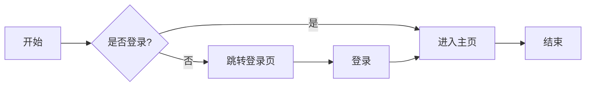
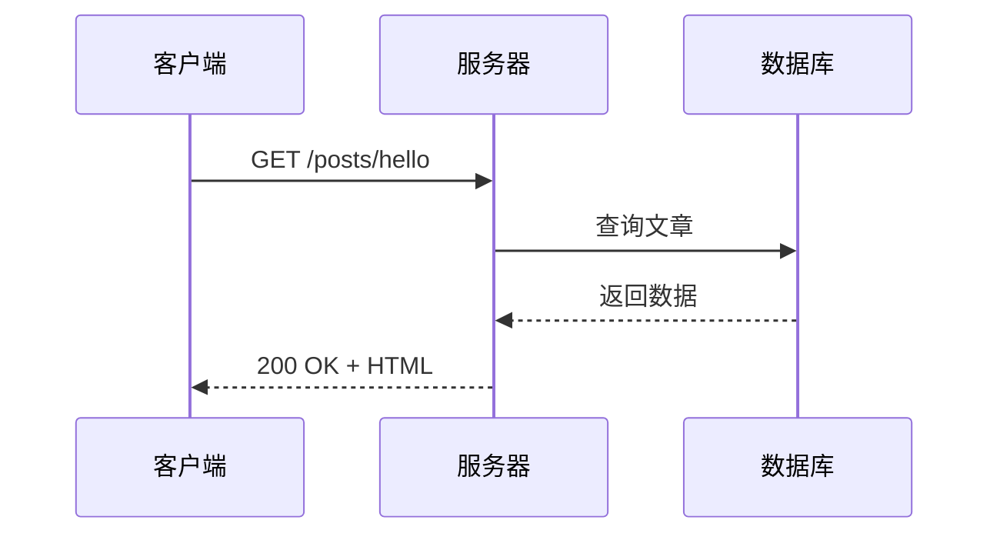
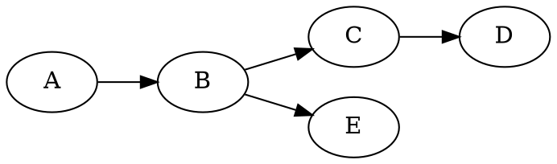

# Markdown 功能综合演示

本文完整演示本站支持的所有 Markdown 扩展功能。

## 一、GFM（GitHub Flavored Markdown）

### 1.1 表格

| 功能 | 语法 | 支持 |
|------|------|:----:|
| 表格 | 管道符分隔 | ✅ |
| 对齐 | `:---:` 居中 | ✅ |
| 任务列表 | `- [ ]` / `- [x]` | ✅ |
| 删除线 | `~~text~~` | ✅ |
| 脚注 | `[^1]` | ✅ |

### 1.2 任务列表

- [x] 已完成：数学公式渲染
- [x] 已完成：代码高亮
- [ ] 待办：更多图表类型
- [ ] 待办：评论系统

### 1.3 删除线

~~这是删除线文字~~，这是正常文字。**粗体**、*斜体*、`行内代码` 都正常。

### 1.4 脚注

这是一段带脚注的文字[^1]，另一个脚注[^2]。

[^1]: 第一个脚注的内容，支持 **Markdown** 格式。
[^2]: 第二个脚注，可以包含 [链接](https://example.com)。

## 二、代码高亮（Monokai 主题）

### Python

```python
def fibonacci(n: int) -> list[int]:
    """计算斐波那契数列"""
    if n <= 0:
        return []
    seq = [0, 1]
    for i in range(2, n):
        seq.append(seq[i-1] + seq[i-2])
    return seq

print(fibonacci(10))
# [0, 1, 1, 2, 3, 5, 8, 13, 21, 34]
```

### JavaScript

```javascript
// 防抖函数
function debounce(fn, delay = 300) {
  let timer = null;
  return (...args) => {
    clearTimeout(timer);
    timer = setTimeout(() => fn.apply(this, args), delay);
  };
}
```

### TypeScript

```typescript
interface User {
  id: number;
  name: string;
  email?: string;
}

const user: User = { id: 1, name: "wunai" };
console.log(user);
```

### Bash

```bash
# 安装依赖
npm install

# 构建项目
npm run build

# 启动开发服务器
npm run dev
```

## 三、KaTeX 数学公式

### 3.1 行内公式

质能方程 $E = mc^2$，勾股定理 $a^2 + b^2 = c^2$，欧拉公式 $e^{i\pi} + 1 = 0$。

### 3.2 块级公式

高斯积分：

$$
\int_{-\infty}^{+\infty} e^{-x^2} \, dx = \sqrt{\pi}
$$

矩阵乘法：

$$
\begin{pmatrix} a & b \\ c & d \end{pmatrix}
\begin{pmatrix} x \\ y \end{pmatrix}
=
\begin{pmatrix} ax + by \\ cx + dy \end{pmatrix}
$$

求和与极限：

$$
\sum_{n=1}^{\infty} \frac{1}{n^2} = \frac{\pi^2}{6}, \qquad
\lim_{x \to 0} \frac{\sin x}{x} = 1
$$

### 3.3 自定义宏

实数集 $\RR$，复数集 $\CC$，整数集 $\ZZ$，自然数集 $\NN$，有理数集 $\QQ$，微分符号 $\dd{x}$。

## 四、mhchem 化学式

### 4.1 化学式

水 $\ce{H2O}$，二氧化碳 $\ce{CO2}$，硫酸 $\ce{H2SO4}$，氨 $\ce{NH3}$，甲烷 $\ce{CH4}$。

### 4.2 化学方程式

燃烧反应：

$$
\ce{CH4 + 2 O2 -> CO2 + 2 H2O}
$$

光合作用：

$$
\ce{6 CO2 + 6 H2O ->[h\nu] C6H12O6 + 6 O2}
$$

离子方程式：

$$
\ce{Ag+ + Cl- -> AgCl v}
$$

同位素与化学键：$\ce{^32_16S}$，$\ce{C#C}$，$\ce{C6H5-CHO}$。

## 五、图表

### 5.1 Mermaid 流程图



### 5.2 Mermaid 序列图



### 5.3 ECharts 图表

```echarts
{"title":{"text":"访问量统计"},"tooltip":{},"xAxis":{"type":"category","data":["周一","周二","周三","周四","周五","周六","周日"]},"yAxis":{"type":"value"},"series":[{"type":"line","data":[120,200,150,80,70,110,130]}]}
```

### 5.4 Graphviz (viz.js)



### 5.5 abc.js 乐谱

```abc
T:小星星
M:4/4
C:G
L:1/4
K:C
C C G G | A A G2 | F F E E | D D C2 |
G G F F | E E D2 | G G F F | E E D2 |
C C G G | A A G2 | F F E E | D D C2 |
```

### 5.6 SmilesDrawer 分子结构式

葡萄糖：

咖啡因：

## 六、自定义短代码

### 6.1 颜色文本

，，。

### 6.2 标记高亮



### 6.3 ==高亮== 语法

这是 ==内联高亮== 文字，用双等号包裹。

### 6.4 参考文献引用

本文参考了 CommonMark 规范[reference:1]、GFM 文档[reference:2] 和 KaTeX 文档[reference:3]。

## 七、中文排版优化

中英文混排自动加空格：使用 React 框架开发的 Next.js 应用，版本号 14.2.3，支持 TypeScript 5.0。

标点符号自动转换：这是一句话,这是另一句话.你好吗?我很好!

括号转换：这是(中文括号)和[方括号]的测试。

## 八、XSS 协议过滤

以下链接被安全过滤，不会执行恶意脚本：

- [危险链接](javascript:alert('xss'))
- [数据链接](data:text/html,<script>alert(1)</script>)

## 九、其他

### 引用

> 这是一段引用。
> 可以有多行。
> > 嵌套引用也支持。

### 图片


### 水平线

---

### 有序列表与无序列表

1. 第一项
2. 第二项
   - 子项 A
   - 子项 B
3. 第三项

### 定义列表

术语
:   定义内容

### 键盘按键

按 <kbd>Ctrl</kbd> + <kbd>C</kbd> 复制。
