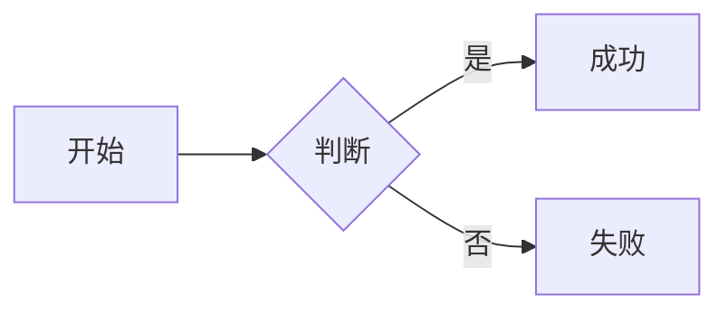
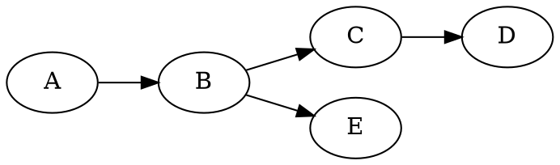

本文档是 **wunai's blog** 项目的「单一信息源（Single Source of Truth）」。

**读者对象**：

- **作者本人**：写新文章前查阅 Frontmatter 字段、 shortcode 语法、常见坑点。
- **AI 助手**：被指派写文章/改文章/扩展功能时，先读完本文档再动手，避免破坏既有约定。

**阅读顺序建议**：先读「一、项目概述」「二、技术栈」「三、目录结构」建立全局观，再按需查阅「五、写作规范」「六、扩展能力清单」「七、AI 写作硬性约束」。

---

## 一、项目概述

**站点名**：wunai's blog  
**站点 URL**：https://newblog.wunai.top  
**站点定位**：学习笔记与生活思考（数学、物理、化学、医学、技术）。  
**部署平台**：Cloudflare Pages（静态导出，`output: "export"`）。  
**默认语言**：中文（`zh`），同时支持英文（`en`），URL 前缀区分：`/zh/...` 与 `/en/...`。

**核心特点**：

1. **纯静态**：构建期把所有 Markdown 渲染成 HTML，部署到 CDN，访问极快。
2. **Markdown 驱动**：文章以 `.md` 文件存放在 `content/<lang>/posts/` 下，不依赖数据库。
3. **扩展能力丰富**：内置 KaTeX 数学、mhchem 化学式、SmilesDrawer 分子结构、Mermaid/ECharts/Graphviz 图表、abc.js 五线谱、自定义 shortcode。
4. **i18n 双语**：每篇文章可同时存在 `zh` 和 `en` 两个版本，URL 互不干扰。
5. **AI 友好**：`author = "AI"` 时自动加红色警示徽章，首页卡片变蓝，让读者一眼识别 AI 生成内容。
6. **可打印**：任意文章页 `Ctrl+P` 可直接导出 PDF，自动隐藏导航/目录/评论，单栏布局，暗色主题回白底。
7. **PWA**：内置 Service Worker，可离线访问已缓存页面，可安装到桌面。
8. **三态主题 + 亚克力材质**：深色 / 浅色 / 跟随系统可切；正文阅读面、文章卡片、上下篇、页脚均为半透底 + 毛玻璃（详见 3.2「界面与视觉约定」）。
9. **可互动点网格背景**：Canvas 铺满视口的点阵，光标/触点经过时点被推开、连线被拉斜，指针离开后弹簧回弹；暗色下自动降低亮度，静止时自动停帧省电。
10. **首页 = 一屏「关于」+ 三篇展示**：`about: true` 的文章正文作为首屏（底部渐隐 + 「继续阅读」），下方是滚动到位渐入的展示位。
11. **友链页 + 页脚联系方式**：友链卡片列表（图片/名称/介绍），页脚展示邮箱、GitHub 与仓库地址。
12. **浮动导航**：左侧目录面板、右侧可拖拽的阅读进度滑块（章节圆点）、回到顶部，均不占布局宽度。

---

## 二、技术栈

### 2.1 框架与运行时

| 类别 | 选型 | 版本 | 用途 |
|------|------|------|------|
| 框架 | Next.js | 16.3.1 | App Router、静态导出、SSG |
| UI 库 | React | 19.2.8 | 组件渲染 |
| 语言 | TypeScript | ^5 | 全站类型安全 |
| 样式 | Tailwind CSS | ^4 | 工具类（PostCSS 插件） |
| 包管理 | npm | - | `package-lock.json` 锁版本 |
| 运行时 | Node.js | ≥ 20.9 | Next.js 16 的最低要求；CI 使用 20 |

> 构建器：Next.js 16 默认使用 **Turbopack**，`next build` 不再跑 ESLint（但**仍会跑 TypeScript 类型检查**，类型错误会直接令构建失败）。

### 2.2 Markdown 处理（unified 生态）

| 包 | 版本 | 作用 |
|------|------|------|
| `unified` | ^11.0.5 | 流式处理管道总入口 |
| `remark-parse` | ^11 | Markdown → mdast |
| `remark-gfm` | ^4.0.1 | GFM 扩展（表格、删除线、任务列表、脚注） |
| `remark-math` | ^6 | 数学公式 `$...$` / `$$...$$` |
| `remark-breaks` | ^4.0.0 | 软换行强制成 `<br>` |
| `remark-rehype` | ^11.1.2 | mdast → hast |
| `rehype-raw` | ^7.0.0 | 保留原始 HTML（shortcode 输出的 `<span>`） |
| `rehype-highlight` | ^7.0.2 | highlight.js 代码高亮 |
| `rehype-katex` | ^7.0.1 | 数学公式渲染（基于 KaTeX） |
| `rehype-slug` | ^6.0.0 | 给标题加 `id` |
| `rehype-autolink-headings` | ^7.1.0 | 标题自动包裹锚点链接 |
| `rehype-stringify` | ^10.0.1 | hast → HTML 字符串 |
| `unist-util-visit` | ^5.1.0 | 依赖已声明但当前未使用：`lib/markdown.ts` 用自带的 `walk` 遍历 |
| `katex` | ^0.16.0 | 数学渲染核心 |
| `katex/contrib/mhchem` | - | `\ce{}` 化学方程式语法扩展 |

### 2.3 内容与辅助

| 包 | 版本 | 作用 |
|------|------|------|
| `gray-matter` | ^4.0.3 | 解析 YAML frontmatter（TOML 由 `lib/content.ts` 自实现解析） |
| `fuse.js` | ^7.5.0 | 客户端模糊搜索 |
| `@iconify/react` | ^6.0.2 | 图标组件 |
| `@iconify/icons-mdi` | ^1.2.48 | Material Design Icons 图标集 |

### 2.4 客户端 CDN 资源（运行时按需加载）

| 资源 | CDN | 加载时机 |
|------|-----|---------|
| KaTeX CSS | jsdelivr 0.16.47 | 全局（layout.tsx `<link>`） |
| highlight.js 主题（monokai） | jsdelivr 11.9.0 | 全局（layout.tsx `<link>`） |
| Mermaid | jsdelivr 10 | 文章含 `.mermaid` 时 |
| ECharts | jsdelivr 5 | 文章含 `.echarts` 时 |
| viz.js（Graphviz） | jsdelivr 3 | 文章含 `.graphviz` 时 |
| abc.js（乐谱） | jsdelivr 6.7.0 | 文章含 `.abc` 时 |
| SmilesDrawer | jsdelivr 2.4.1 | 文章含 `.chem` 时 |
| Giscus 评论 | giscus.app | 滚动到评论区时懒加载 |

### 2.5 工程化

| 工具 | 配置文件 | 作用 |
|------|---------|------|
| ESLint + eslint-config-next | `eslint.config.mjs` | 代码风格 |
| PostCSS + @tailwindcss/postcss | `postcss.config.mjs` | Tailwind v4 编译 |
| TypeScript | `tsconfig.json` | 类型检查（`strict: true`，路径别名 `@/*`） |
| Cloudflare Pages | `wrangler.toml` | 部署配置（`pages_build_output_dir = "out"`） |

---

## 三、目录结构（每个文件的作用）

下面是项目根目录 `my-app/` 的完整树形结构，每个文件都标注作用。

```
my-app/
├── app/                         # Next.js App Router 路由层
│   ├── layout.tsx               # 根布局：HTML 骨架、全局 SVG 滤镜定义、KaTeX/highlight.js CDN、Service Worker 注册、RouteLoading
│   ├── page.tsx                 # 根路径 "/" → 重定向到 /zh/
│   ├── globals.css              # 全站 CSS 变量、布局、组件样式、打印样式、动画
│   ├── not-found.tsx            # 全局 404 页
│   ├── robots.ts                # /robots.txt 生成（allow: /，sitemap 指向）
│   ├── sitemap.ts                # /sitemap.xml 生成（首页、列表页、所有文章）
│   ├── favicon.ico              # 站点图标
│   └── [lang]/                  # 动态路由：语言前缀 zh / en
│       ├── layout.tsx           # 语言层布局：Header + main + Footer
│       ├── page.tsx             # 首页：首屏只露一屏「关于」文章（底部渐隐 + 继续阅读）+ 向下滑动图标 + 展示位
│       ├── archives/
│       │   └── page.tsx         # 归档页：按年分组列出文章
│       ├── categories/
│       │   ├── page.tsx         # 分类云
│       │   └── [category]/
│       │       └── page.tsx     # 单个分类下的文章列表
│       ├── links/
│       │   └── page.tsx         # 友链页：介绍 + 友链卡片列表（数据在 lib/links.ts）
│       ├── posts/
│       │   ├── page.tsx         # 文章列表页
│       │   └── [slug]/
│       │       └── page.tsx     # 文章详情页：面包屑、标题、meta、TOC、正文、上下篇、评论、JSON-LD
│       ├── search/
│       │   └── page.tsx         # 搜索页：挂载 <Search> 组件
│       └── tags/
│           ├── page.tsx         # 标签云
│           └── [tag]/
│               └── page.tsx     # 单个标签下的文章列表
│
├── components/                  # React 组件（共 14 个）
│   ├── Header.tsx               # 顶部导航：logo + 菜单 + 字号/主题/语言工具
│   ├── Footer.tsx               # 页脚：欢迎语 + 邮箱/GitHub/仓库卡片 + 「感谢你的阅读」 + 版权行
│   ├── PostCard.tsx             # 文章卡片：3D 鼠标跟踪倾斜 + 亚克力材质 + AI 蓝色变体
│   ├── PostBody.tsx             # 正文容器：客户端渲染 mermaid/echarts/graphviz/abc/smiles-drawer/代码复制
│   ├── PostNav.tsx              # 浮动导航：sticky 章节标题 + TOC 面板 + 阅读进度滑块 + 章节圆点 + 回到顶部
│   ├── InteractiveBackground.tsx # 可互动点网格背景（Canvas：指针推力 + 弹簧回弹，暗色降亮度，静止停帧）
│   ├── ScrollReveal.tsx         # 滚动到位渐入容器（IntersectionObserver，无 JS 时有 noscript 兜底）
│   ├── Comments.tsx             # Giscus 评论（滚动到视口才加载，明暗自适应）
│   ├── PrintControls.tsx        # 文章页按钮：「打印」（window.print）+ 「下载 MD」（Blob 下载原文）
│   ├── Search.tsx               # Fuse.js 客户端搜索（拉取 /search-index.<lang>.json）
│   ├── ThemeToggle.tsx          # 主题切换：light / dark / auto（localStorage 持久化）
│   ├── FontSizeControl.tsx      # 字号控制：85%–130% 七档（localStorage 持久化）
│   ├── LangSwitcher.tsx         # 语言切换：/zh/xxx ↔ /en/xxx
│   └── RouteLoading.tsx         # 路由切换 Loading 动画（竖向贴右、镂空文字、进度条、闪光、拖尾）
│
├── lib/                         # 业务逻辑层（无 React，纯 TS）
│   ├── site.ts                  # 站点配置：标题/作者/URL/菜单/i18n 文案/联系方式/PostFrontmatter 类型/Post 类型
│   ├── content.ts               # 内容读取：TOML/YAML frontmatter 解析、文章加载/排序/筛选/归档/首页展示位与「关于」文章取数
│   ├── links.ts                 # 友链数据：名称/地址/图片/中英介绍
│   ├── markdown.ts              # Markdown 渲染：unified 管道、自定义 shortcode/CJK 优化/XSS 过滤/TOC 提取
│   └── icons.ts                 # Iconify 图标集中导入（白名单，新图标必须登记）
│
├── content/                     # Markdown 内容源
│   ├── zh/
│   │   ├── archives.md           # （占位，归档页由路由生成，不需要）
│   │   ├── search.md             # （占位）
│   │   └── posts/
│   │       ├── _index.md         # 列表页占位（空文件即可）
│   │       ├── 你好世界.md        # 首页「关于」文章（about: true + pinned: true）
│   │       ├── 博客.md
│   │       ├── 写作模板.md         # 旧版写作速查（draft: true，保留作历史参考）
│   │       ├── markdown基础语法.md
│   │       ├── markdown-功能综合演示.md
│   │       ├── 希腊字符.md
│   │       ├── 国际基本单位换算.md
│   │       ├── 抗生素发展史.md
│   │       ├── 奎宁.md
│   │       ├── 离轴全息奠基性论文的硬核解读.md
│   │       └── 博客书写规范.md     # ← 本文
│   └── en/
│       ├── archives.md
│       ├── search.md
│       └── posts/
│           ├── _index.md
│           ├── hello-world.md
│           ├── math-chem-code-demo.md
│           └── turing-machine.md
│
│ 注：中文站有「关于」文章（`about: true`），英文站没有，因此英文首页首屏回退为 SITE.homeInfo 的简介。
│
├── public/                      # 静态资源（构建时原样拷贝到 out/）
│   ├── manifest.webmanifest     # PWA manifest
│   ├── sw.js                    # Service Worker：预缓存首页、SWR 页面、cache-first 静态、network-first CDN
│   ├── offline.html             # 离线兜底页
│   ├── rss.xml                  # RSS feed（构建时由 scripts/generate-rss.mjs 生成）
│   ├── search-index.zh.json     # 中文搜索索引（构建时由 scripts/generate-search-index.mjs 生成）
│   ├── search-index.en.json     # 英文搜索索引
│   ├── file.svg / globe.svg / next.svg / vercel.svg / window.svg  # 占位图（可删）
│
├── scripts/                     # 构建前置脚本
│   ├── generate-search-index.mjs  # 扫描 content/，生成 search-index.<lang>.json
│   └── generate-rss.mjs           # 扫描 content/，生成 rss.xml（取最新 20 篇）
│
├── out/                         # 构建产物（next build 输出，部署到 Cloudflare Pages 的目录）
│
├── next.config.ts               # Next.js 配置：output="export"、images.unoptimized、trailingSlash
├── tsconfig.json                # TypeScript 配置
├── postcss.config.mjs           # PostCSS 配置（Tailwind v4）
├── eslint.config.mjs            # ESLint 配置
├── wrangler.toml                # Cloudflare Pages 部署配置
├── package.json                 # 依赖与脚本（prebuild 跑两个生成脚本）
├── package-lock.json            # 版本锁
├── .gitignore
├── AGENTS.md                    # Next.js agent 规则 + 「工作流约定」（改代码前先 git pull）
├── CLAUDE.md                    # 指向 AGENTS.md
└── README.md                    # 项目文档：特性、写作指南、部署与排错
```

仓库根目录（`my-app/` 之外）还有两件东西，本文档同样适用于它们：

```
TheBestandMostEfficient-Blog/
├── my-app/                      # Next.js 应用（上文展开）
├── .github/workflows/deploy.yml # GitHub Actions：npm ci → npm run build → wrangler pages deploy out
└── README.md                    # 项目级说明（与 my-app/README.md 分工：前者面向贡献者，后者是应用入口）
```

### 3.1 关键文件解读

#### `lib/site.ts` — 站点单一配置点

所有「站点级常量」集中在此：标题、作者、URL、菜单、i18n 文案、**页脚联系方式 `contact`**、`PostFrontmatter` / `Post` 类型定义。**改站点信息只改这一个文件**。

#### `lib/content.ts` — 内容读取与查询

- 自实现简易 TOML 解析（`+++ ... +++`），同时支持 `gray-matter` 的 YAML。
- 日期规范化：YAML 解析出的 `Date` 对象统一转 `YYYY-MM-DD` 字符串，避免时区错乱。
- 字数统计：中文按字、英文按 word，求和。
- 文章排序：**非 AI 在前 + 按 date 降序**，**AI 在后 + 按 date 降序**。这意味着 AI 文章永远排在人工文章下面。
- 缓存：`_cache` 对象按 lang 缓存，避免重复读盘。
- 取数辅助函数：`getPosts` / `getPost` / `getPinnedPosts` / `getPrevNext` / `getArchives` / `getAllTags` / `getPostsByTag` 等；首页相关两个：
  - `getHomeShowcase(lang, limit = 3)` —— 展示位取数：有置顶取置顶，否则取最新非 AI 文章；两者都排除 `about` 与 `hiddenInHomeList`。
  - `getAboutPost(lang)` —— 取 `about: true` 的文章（首页首屏用）。

#### `lib/links.ts` — 友链数据

`FRIEND_LINKS` 数组，每项 `{ name, url, avatar?, description? }`；`friendText()` 按当前语言取介绍。友链页在 `app/[lang]/links/page.tsx`，菜单入口在 `SITE.menu`。**新增/更换友链只改这个文件**。

#### `lib/markdown.ts` — Markdown 渲染管道

`renderMarkdown(post)` 返回 HTML 字符串。管道顺序（**顺序很重要，不能乱**）：

1. `remarkParse` — 解析 Markdown
2. `remarkGfm` — GFM 扩展
3. `remarkMath` — 识别 `$...$` 数学语法
4. `remarkBreaks` — 软换行变 `<br>`
5. `remarkCustomShortcodes` — **自定义插件**：处理 `==高亮==`、`[reference:N]`、``、``、``
6. `remarkRehype` — 转 hast（`allowDangerousHtml: true` 让 shortcode 输出的 HTML 留下来）
7. `rehypeRaw` — 把混入的原始 HTML 字符串解析成 hast 节点
8. `rehypeDiagramBlocks` — **自定义插件**：把 ` ```mermaid ` 等代码块转成 `<div class="mermaid">`
9. `rehypeHighlight` — 代码高亮
10. `rehypeKatex` — 数学渲染（注入自定义宏 `\RR \CC \ZZ \NN \QQ \dd`）
11. `rehypeSlug` — 标题加 id
12. `rehypeAutolinkHeadings` — 标题包裹锚点
13. `rehypeImages(post)` — **自定义插件**：图片懒加载、相对路径转绝对
14. `rehypeXssFilter` — **自定义插件**：拦截 `javascript:` / `vbscript:` / `data:` 协议
15. `rehypeCjkOpt` — **自定义插件**：CJK 与 ASCII 间加空格、中文标点转换（**跳过 KaTeX 内部文本**）
16. `rehypeStringify` — 输出 HTML

#### `components/PostBody.tsx` — 客户端渲染中枢

服务端把 HTML 字符串塞进 `<div dangerouslySetInnerHTML>`，客户端 `useEffect` 扫描 DOM：

- `pre` → 加「Copy」按钮
- `.mermaid` → 加载 mermaid.js 并 `run()`
- `.echarts` → 加载 echarts 并 `init()` + `ResizeObserver`
- `.chem` → 加载 smiles-drawer，`parse()` 异步回调里 `drawer.draw(tree, canvasId, "light")`
- `.graphviz` → 加载 viz.js，`await Viz.instance()` 后 `renderSVGElement()`
- `.abc` → 加载 abcjs，`renderAbc()`

**所有第三方库都用 `loadScript` 动态注入，且用 `window.xxxLoaded` 标志位防重复加载**。

#### `app/[lang]/posts/[slug]/page.tsx` — 文章详情页

职责：

- 调 `getPost` / `renderMarkdown` / `extractToc` / `getPrevNext`
- **单栏布局**：正文居中（`.post-layout` 最大宽 800px），左侧「全部文章」栏已移除；目录 / 进度滑块 / 回到顶部由 `PostNav` 以浮动形式提供，不占布局宽度
- meta 信息行：日期、阅读时间（`wordCount/400`）、字数、作者徽章
- 标签链接
- 页头按钮：「打印」（`t.printSingle` → `window.print()`）与「下载 MD」（前端用 `buildFullMarkdown()` 重建含 frontmatter 的原文后 Blob 下载）
- JSON-LD 结构化数据（`BlogPosting` schema，利于 SEO）
- 上下篇导航 + Giscus 评论区

> 打印页眉页脚已移除（早期版本存在 `print-header` / `print-footer`，现已从 DOM 中删除，打印样式里只保留隐藏它们的兼容规则）。

#### `components/InteractiveBackground.tsx` — 可互动点网格背景

- 挂在根布局 `<body>` 最前面，CSS 为 `.bg-canvas { position: fixed; z-index: -1; pointer-events: none }`，因此不拦截任何点击/选中。
- 网格点坐标/偏移/速度存在一个 `Float32Array` 里；指针（或触点）影响力半径内的点被推开，离开后由弹簧回弹。
- 位移分 4 档决定点的尺寸与透明度，并从前景色过渡到强调色；相邻点之间画 0.6px 细线（按位移分 2 档批量 `stroke`）。
- 暗色下乘一个亮度系数（`alphaScale`）压低亮度；**网格完全静止时停帧**，下一个指针事件才唤醒（省电）。
- 尊重 `prefers-reduced-motion`：只画一帧静态网格，不启动循环、不绑定交互。
- 可调参数全部集中在文件顶部常量区（间距、点数上限、影响半径、推力、弹簧刚度、阻尼、线宽、透明度等）。

#### `app/[lang]/page.tsx` — 首页

首页只有三段，且首屏有两种形态：

| 条件 | 首屏 |
|------|------|
| 存在 `about: true` 的文章 | 渲染该文正文（`getAboutPost()` + `renderMarkdown()`，经 `PostBody` 输出以保留代码高亮/复制按钮） |
| 无 `about` 文章（如英文站） | 回退为 `SITE.homeInfo` 的一句话简介，撑满 `100svh - header` |

要点：

1. **首屏渐入**：`home-intro-in` 各 2s，标题先、正文延后 0.25s。
2. **正文只露一屏**：`.home-about-body` 用 `max-height: clamp(320px, 100svh - 300px, 620px)` + `overflow: hidden` + 底部 `mask-image` 渐隐。**这是纯 CSS 裁剪，不切割 HTML**，因此不会把标签/代码块切坏；代价是首页仍会带上整篇 HTML。
3. **继续阅读**：`.home-about-more` 指向该文章的详情页地址。
4. **向下滑动图标**：锚点 `#home-posts`，复用 `html { scroll-behavior: smooth }`；在简介版首屏绝对定位钉底，在关于版里跟在正文后正常排版。
5. **展示位**：`getHomeShowcase()` 取最多 3 篇（有置顶取置顶，否则取最新非 AI），并用 `ScrollReveal` 包裹实现滚动到位渐入；文章卡片传 `hidePinnedBadge` 不显示“置顶”徽标。

#### `components/Footer.tsx` — 页脚

从 `SITE.contact` 读欢迎语与联系方式，渲染为三张亚克力卡片：邮箱（`mailto:`）、GitHub 主页、本站仓库（后两个新窗口打开，显示文本自动去掉 `https://`）。底部细分割线下是原有版权行（Powered by Next.js · Hosted on Cloudflare）。

#### `components/ScrollReveal.tsx` — 滚动到位渐入

首页展示位用它包裹。初始隐藏态写在 CSS（`.reveal`），进入视口后由 `IntersectionObserver` 加上 `.is-shown`；元素内附一段 `<noscript>` 样式兼底，**禁用 JS 时内容不会永久不可见**（静态导出站点必须注意这一点）。

### 3.2 界面与视觉约定（改样式前必读）

改 `app/globals.css` 或组件样式前，先看这几条已经定下的约定，避免把现有观感弄坏：

**1. 全站直角，无圆角**

所有 `border-radius` 均为 `0`，包括圆形指示（进度圆点、目录小点、回到顶部按钮、缓存红点）。新增元素请继续用直角；只在 `.post-card::after` / `.post-content::before` 里留了 `border-radius: inherit`，为以后改回圆角留口子。

**2. 亚克力材质（半透底 + 毛玻璃）**

材质参数统一在两组 CSS 自定义属性里，亮/暗各一套，随 `html.dark` 切换：

| 令牌 | 用途 | 浅色 | 暗色 |
|------|------|------|------|
| `--reading-*` | 正文阅读面（`.post-content`）；页脚借用它的颜色与模糊 | `rgba(255,255,255,0.965)`，模糊 14px | `rgba(44,44,51,0.68)`，模糊 22px |
| `--card-acrylic-*` | 文章卡片、上下篇、友链卡片、页脚按钮 | `rgba(255,255,255,0.82)`，模糊 10px | `rgba(54,54,62,0.62)`，模糊 16px |

**浅色靠不透明，暗色靠抬亮的玻璃色**：浅色下正文是深色文字，背底亮点穿透字形会干扰阅读，所以阅读面接近不透明；暗色下如果沿用“与底色接近的暗色”，面板和页面几乎同色、根本看不出是块“面”，所以改成“抬亮的玻璃色 + 更大的模糊”。

**暗色下不要白色渐变**：`--reading-sheen` / `--card-acrylic-sheen`（顶部白光泽）与 `--reading-inner-glow` / `--card-acrylic-glow`（白色内高光）在暗色里都取全透明值，并在暗色下把 `.post-content::before` 直接 `display: none`。写成全透明而不是 `none`，是因为它们在 CSS 里是逗号列表的一项（`background: sheen, bg` / `box-shadow: shadow, glow`），写成 `none` 会让整条声明失效。卡片背后原先那层白色发光雾团（`--fog-*`）也已删除。

两条硬约束：

- **`backdrop-filter` 不能和 `transform` 加在同一元素上**（分组属性会被强制扁平化）。所以卡片的亚克力层放在 `::after` 伪元素里，而卡片本身由 JS 写行内 `transform` 做 3D 倾斜；正文阅读面则把入场动画放在内层 `.article` 上。
- **底色必须留给亚克力层**：元素自身保持 `background: transparent`，否则 `backdrop-filter` 会把元素自己的底当背景模糊，透不出后面的点网格。内容需 `position: relative; z-index: 1` 压在材质层之上。

**3. 背景层**

- `.bg-canvas`（点网格，`InteractiveBackground`）：明暗主题都启用。
- 未来若要再加背景层：负 `z-index` + `pointer-events: none`，并在 `@media print` 里隐藏。

**4. 主题与首屏无闪烁**

主题（light / dark / auto）存在 `localStorage`，在 `<head>` 内联脚本里完成引导（避免 FOUC）；组件里靠 `MutationObserver` 监听 `html` 的 `class` 变化来重新读色。

**5. 打印降级**

`@media print` 里必须把两类东西清干净：亚克力（`background: none`、`backdrop-filter: none`、`position/z-index` 归零）与动画（`animation: none`）；首页还需取消正文裁切并隐藏「继续阅读」与向下滑图标。

**6. 图标是白名单**

图标全部从 `lib/icons.ts` 显式 import 并登记。**新增图标必须先在那里登记**，否则 TypeScript 报 `TS7053`，构建直接失败（`next build` 会跑类型检查）。

**7. 工作流约定**

改代码前先 `git pull`（见 `my-app/AGENTS.md`），提交信息用中文、一次改动一个主题。

---

## 四、写作流程

### 4.1 新建文章

1. 在 `content/zh/posts/` 下新建 `.md` 文件（文件名建议中文，会作为 URL slug）。
2. 复制下方「五、Frontmatter 规范」的模板填头。
3. 写正文。
4. `draft = true` 时本地预览可见、不发布；改 `false` 或删该行即发布。
5. 想让英文版同步，在 `content/en/posts/` 建同名 `.md`（slug 必须相同，URL 才能互相对应）。

### 4.2 本地预览

```bash
cd my-app
npm run dev
# 打开 http://localhost:3000  → 自动重定向到 /zh/
```

### 4.3 构建与部署

```bash
# 完整构建（prebuild 会先跑搜索索引和 RSS 生成脚本）
npm run build
# 产物在 out/，可本地预览
npx serve out
```

推送到 `main` 后自动部署，目前**同时存在两条管线**：

| 管线 | 位置 | 说明 |
|------|------|------|
| GitHub Actions | `.github/workflows/deploy.yml` | `npm ci` → `npm run build` → `wrangler pages deploy out`，需仓库 Secret `CLOUDFLARE_API_TOKEN` / `CLOUDFLARE_ACCOUNT_ID` |
| Cloudflare Pages Git 集成 | Cloudflare 控制台 | 需在 Build configuration 里指定根目录 |

> ⚠️ **真正的坑**：仓库根目录下没有 `package.json`（应用在 `my-app/`），而自动安装依赖是绑在 **Root directory** 上的。若把 Cloudflare 的根目录留空、只在构建命令里写 `cd my-app && npm run build`，安装步骤会直接被跳过，构建报 `sh: 1: next: not found`（退出码 127）。
>
> 两种正确配法（二选一）：
> 1. **Root directory = `my-app`**，Build command = `npm run build`，Output = `out`（推荐，这样能找到 `my-app/wrangler.toml`）
> 2. 根目录留空，Build command = `cd my-app && npm ci && npm run build`，Output = `my-app/out`
>
> 另外两条管线会同时构建（每次推送构建两次），实际使用建议只保留一条。

### 4.4 文件名 → URL 映射

| 文件路径 | URL |
|---------|-----|
| `content/zh/posts/抗生素发展史.md` | `/zh/posts/抗生素发展史/` |
| `content/en/posts/turing-machine.md` | `/en/posts/turing-machine/` |

注意 `trailingSlash: true`，URL 末尾带 `/`。

---

## 五、写作规范

### 5.1 Frontmatter（文件头，必写）

支持 **YAML**（`---` 包裹）和 **TOML**（`+++` 包裹）两种格式，**TOML 必须在文件第 1 行，前面不能有空行**。

#### YAML 模板（推荐，与 `markdown-功能综合演示.md` 一致）

```yaml
---
title: "文章标题"
date: 2026-09-09
draft: false
tags: ["标签1", "标签2"]
categories: ["分类"]
summary: "一句话摘要，显示在文章列表卡片上。"
author: "wunai"  # 或 "AI"，详见 5.2
showToc: true    # 可选，默认 true
# pinned: true                 # 可选：首页置顶
# about: true                  # 可选：作为「关于」文章，正文渲染在首页首屏（并从首页展示位中排除）
# hiddenInHomeList: true       # 可选：不在首页列表显示（URL 仍可访问）
# description: "SEO meta description"  # 可选，不写用 summary
# keywords: ["SEO", "关键词"]   # 可选
# canonicalURL: "https://..."   # 可选：规范链接（转载时用）
# cover:                        # 可选：封面图
#   image: "/images/xxx/cover.png"
#   caption: "图源：..."
#   hidden: false
#   relative: false
# references:                   # 可选：参考文献列表
#   - title: "参考标题"
#     author: "作者"
#     year: "2026"
#     url: "https://..."
---
```

#### TOML 模板（与 `写作模板.md` 一致）

```toml
+++
title = '文章标题'
date = 2026-09-09
draft = false
tags = ["标签1", "标签2"]
categories = ["分类"]
summary = '一句话摘要'
author = "wunai"

+++
```

#### 字段一览（完整）

| 字段 | 类型 | 必填 | 默认 | 说明 |
|------|------|:----:|------|------|
| `title` | string | ✅ | - | 文章标题（作为 H1，正文里**不要再写 `# 标题`**） |
| `date` | string/Date | ✅ | - | 发布日期，影响排序。**时间越新排越靠前** |
| `draft` | boolean | - | false | `true`=草稿不发布 |
| `author` | string | - | 站点默认 | 控制视觉标记，详见 5.2 |
| `tags` | string[] | - | `[]` | 标签数组 |
| `categories` | string[] | - | `[]` | 分类数组 |
| `summary` | string | - | 正文前 120 字 | 列表卡片摘要 |
| `description` | string | - | summary | SEO meta description |
| `pinned` | boolean | - | false | 首页置顶 |
| `about` | boolean | - | false | 作为「关于」文章：正文渲染在首页首屏，且不再出现在首页展示位 |
| `pinnedDescription` | string | - | - | 置顶卡片附加描述。**当前代码只解析并存入 `Post`，没有任何地方渲染它**；保留字段备用 |
| `hiddenInHomeList` | boolean | - | false | 不在首页列表显示 |
| `showToc` | boolean | - | true | 显示/隐藏目录 |
| `cover` | object | - | - | 封面图（`image` / `caption` / `hidden` / `relative`） |
| `references` | object[] | - | - | 参考文献（`title` / `url` / `author` / `year`），文末自动生成「参考文献」节 |
| `keywords` | string[] | - | - | SEO keywords |
| `canonicalURL` | string | - | - | 规范链接（转载标注原文） |

### 5.2 作者字段与 AI 标记（核心规则）

`author` 字段**不只是署名**，它控制首页卡片颜色和详情页警示徽章，**必须按事实填写**。

| 写法 | 首页卡片 | 详情页徽章 | 适用场景 |
|------|---------|-----------|---------|
| `author: "AI"` | 标题/摘要/日期**整体变蓝** | 🔴 红色胶囊：「注意⚠️ 本文由 AI 生成，可能存在误区，斟酌阅读！！」 | AI 生成/整理/润色/扩写 |
| `author: "wunai"` | 正常黑白灰 | ⚪ 灰色胶囊：「作者：wunai」 | wunai 原创 |
| `author: "其他"` | 正常黑白灰 | ⚪ 灰色胶囊：「作者：其他」 | 转载、笔名 |
| 不写 `author` | 正常黑白灰 | 无徽章 | 继承站点默认 |

**大小写不敏感**：`"ai"` / `"Ai"` / `"aI"` 都等同于 `"AI"`。

**判断标准**：如果读者看到文章不是 AI 生成的会惊讶，就应该标 AI。

| 情况 | 是否标 AI |
|------|:--------:|
| 全文 AI 生成，仅人工改错别字/格式 | ✅ 标 AI |
| 人类给大纲 + 素材，AI 行文 | ✅ 标 AI |
| NotebookLM AI 概览 / Source 整理 | ✅ 标 AI |
| AI 初稿 + 人工修改 >50%（加入大量个人经验） | ✅ 仍标 AI（文末可注明"AI 初稿 + 人工深度改写"） |
| 纯人工逐字写 | ❌ 写 `"wunai"` 或不写 |
| 翻译外文 + AI 辅助翻译 | ✅ 标 AI（纯人工翻译不标） |

**打印行为**：`author = "AI"` → 红色徽章**不打印**（不进 PDF）；其他 → 灰色徽章保留。

### 5.3 文章排序规则

由 `lib/content.ts` 的 `loadPostsForLang` 决定：

1. 先取所有非 AI 文章，按 `date` **降序**（新在前）。
2. 再取所有 AI 文章，按 `date` **降序**。
3. 拼接：`[非AI新→旧, AI新→旧]`。

**想让某篇文章靠前**：把 `date` 写新一点。AI 文章无论 date 多新，永远排在所有非 AI 文章之后。

### 5.4 推荐文章结构（科普 / 技术类）

```markdown
---
title: "文章标题"
date: 2026-09-09
draft: false
tags: ["标签"]
categories: ["分类"]
summary: "一句话摘要"
---

## 引言
（背景、为什么读这篇、读完能得到什么）

## 一、核心概念
### 子概念 1
### 子概念 2

## 二、实践 / 证明 / 展开

## 三、延伸 / 常见误区

## 总结

---

## 参考资料
1. [参考资料名称](URL)
```

正文从 `##`（二级标题）开始，因为 `title` 已经是 H1。

---

## 六、Markdown 扩展能力清单

### 6.1 基础 Markdown（GFM）

| 元素 | 语法 | 备注 |
|------|------|------|
| 二级标题 | `## 标题` | 正文从 `##` 开始 |
| 三级标题 | `### 标题` | |
| 粗体 | `**粗体**` | |
| 斜体 | `*斜体*` | |
| 删除线 | `~~text~~` | GFM 扩展 |
| 行内代码 | `` `code` `` | |
| 链接 | `[文字](url)` | |
| 自动链接 | `<https://...>` | |
| 高亮 | `==text==` | 自定义 shortcode，黄色背景 |
| 无序列表 | `- item` | |
| 有序列表 | `1. item` | |
| 任务列表 | `- [x]` / `- [ ]` | GFM |
| 引用 | `> text` | 可嵌套 `> >` |
| 脚注 | `[^id]` + `[^id]: 内容` | 编号全局唯一 |
| 表格 | `\| a \| b \|` | 见 6.7 坑点 |
| 水平线 | `---` | |
| 键盘 | `<kbd>Ctrl</kbd>` | HTML 直写 |
| 下标 | `<sub>2</sub>` | HTML 直写 |
| 上标 | `<sup>2</sup>` | HTML 直写 |
| 小字 | `<small>text</small>` | HTML 直写 |

### 6.2 代码块（语法高亮）

````markdown
```python
def fib(n):
    return n if n < 2 else fib(n-1) + fib(n-2)
```
````

支持语言：`python` `javascript` `typescript` `bash` `sql` `go` `json` `toml` `yaml` `html` `css` `rust` `java` `c` `cpp` 等（highlight.js autodetect）。

代码块右上角悬停有「Copy」按钮（`components/PostBody.tsx` 客户端注入）。

### 6.3 数学公式（KaTeX）

#### 行内

```markdown
质能方程 $E = mc^2$，欧拉公式 $e^{i\pi} + 1 = 0$。
```

#### 块级

```markdown
$$
\int_{-\infty}^{\infty} e^{-x^2} \, dx = \sqrt{\pi}
$$
```

#### 自定义宏（`lib/markdown.ts` 已注册）

| 宏 | 展开为 |
|------|------|
| `\RR` | `\mathbb{R}` |
| `\CC` | `\mathbb{C}` |
| `\ZZ` | `\mathbb{Z}` |
| `\NN` | `\mathbb{N}` |
| `\QQ` | `\mathbb{Q}` |
| `\dd` | `\mathrm{d}` |

写 `$\RR$` 直接得到实数集 ℝ。

#### 常用示例

矩阵：

```latex
$$
\begin{bmatrix} a & b \\ c & d \end{bmatrix}
\begin{bmatrix} x \\ y \end{bmatrix}
=
\begin{bmatrix} ax + by \\ cx + dy \end{bmatrix}
$$
```

分段函数：

```latex
$$
f(x) = \begin{cases} x^2, & x \geq 0 \\ -x, & x < 0 \end{cases}
$$
```

### 6.4 化学式（mhchem）

用 `\ce{...}` 包裹，行内和块级都行。

```markdown
水是 $\ce{H2O}$，硫酸是 $\ce{H2SO4}$。

$$\ce{2H2 + O2 -> 2H2O}$$

$$\ce{N2(g) + 3H2(g) <=>[高温、高压][催化剂] 2NH3(g)}$$

$$\ce{Ag+ + Cl- -> AgCl v}$$      <- v 表示沉淀
$$\ce{Zn + 2H+ -> Zn^{2+} + H2 ^}$$ <- ^ 表示气体
```

### 6.5 化学结构式（SmilesDrawer shortcode）

```markdown



```

**支持三种格式**（`lib/markdown.ts` 的 `remarkCustomShortcodes`）：

1. `` — 仅 SMILES
2. `` — 仅 SMILES（无引号）
3. `` — 完整版

**SMILES 字符串从 [PubChem](https://pubchem.ncbi.nlm.nih.gov/) 查询**，复制 "Canonical SMILES" 或 "Isomeric SMILES"。

> ⚠️ **坑**：SMILES 错误会渲染出错误结构但不会报错。复杂分子（如含 S 的 β-内酰胺类）务必核对硫原子等关键元素是否在 SMILES 里。

### 6.6 颜色与标记 shortcode

#### 行内彩色文字

```markdown


```

支持 9 种预设色名：`red` `orange` `yellow` `green` `cyan` `blue` `purple` `pink` `gray`/`grey`，也可传 hex。

#### 黄色高亮标记

```markdown
这是 ==内联高亮== 文字（双等号语法）。
```

### 6.7 表格（含坑点）

#### 基础

```markdown
| 姓名 | 年龄 | 城市 |
|------|------|------|
| 张三 | 25   | 北京 |
```

#### 对齐

```markdown
| 左对齐 | 居中  | 右对齐 |
|:-------|:----:|-------:|
| 左     |  中  |     右 |
```

#### ⚠️ 表格内的绝对值符号 `|` 必须转义

表格单元格用 `|` 分隔，如果内容写 `$y = |f(x)|$`，里面的 `|` 会被误判为列分隔符，**表格错乱**。

**错误**：

```markdown
| 解析式 |
|--------|
| $y = |f(x)|$ |
```

**正确**（用 `\lvert` / `\rvert`）：

```markdown
| 解析式 |
|--------|
| $y = \lvert f(x) \rvert$ |
```

`\lvert` / `\rvert` 在 KaTeX 下渲染效果和 `|` 一样，且不冲突。**表格内的绝对值、范数、分段函数边界都用这两个命令**。

#### ⚠️ 表格内行内化学公式的下标 `_` 转义

`$...$` 行内公式里的下划线会被 Markdown 误判为斜体，**必须写成 `\_{}`**：

```markdown
碳-14：$\ce{^{14}\_{6}C}$     <- 正确
```

块级公式 `$$...$$` 里不需要转义。

### 6.8 图表与乐谱（代码块触发）

全部浏览器端渲染，无需后端。在 `components/PostBody.tsx` 客户端扫描 `.mermaid` / `.echarts` / `.graphviz` / `.abc` 类的 `<div>` 并加载对应库。

#### Mermaid（流程图 / 时序图 / 甘特图 / 饼图 等）

````markdown

````

关键字换类型：`flowchart TD` / `sequenceDiagram` / `gantt` / `pie showData` / `classDiagram` / `stateDiagram-v2` / `gitGraph`。自动适配明/暗主题。

#### ECharts

写法一（直接 JSON）：

````markdown
```echarts
{
  "title": { "text": "访问来源", "left": "center" },
  "tooltip": { "trigger": "item" },
  "series": [{
    "type": "pie",
    "radius": ["40%", "70%"],
    "data": [
      { "value": 1048, "name": "搜索引擎" },
      { "value": 735,  "name": "直接访问" }
    ]
  }]
}
```
````

写法二（需要变量计算时写完整 JS，结果赋给 `__opt`）：

````markdown
```echarts
var months = ['1月','2月','3月'];
var uv = [820, 932, 901];
__opt = {
  title: { text: 'UV 趋势' },
  xAxis: { type: 'category', data: months },
  series: [{ name: 'UV', type: 'line', data: uv }]
};
```
````

容器自动设最小高度 360px，带 `ResizeObserver` 响应式。

#### Graphviz DOT

````markdown

````

#### abc.js 五线谱

````markdown
```abc
T:小星星
M:4/4
L:1/4
K:C
C C G G | A A G2 | F F E E | D D C2 |
```
````

### 6.9 图片

#### 单文件写法（简单文章）

图片放 `public/images/你的目录/`，正文用绝对路径：

```markdown

*图 1：动物细胞结构。图源：XXX*
```

`lib/markdown.ts` 的 `rehypeImages` 自动加 `loading="lazy"` 和 `decoding="async"`，相对路径会转成 `/<lang>/posts/<slug>/<src>`。

#### 资源外链

```markdown

```

### 6.10 参考文献引用

在 frontmatter 写 `references` 数组，正文里用 `[reference:N]`（N 从 1 开始）引用：

```yaml
references:
  - title: "CommonMark 规范"
    author: "CommonMark"
    year: "2024"
    url: "https://commonmark.org/"
```

```markdown
本文参考了 CommonMark 规范[reference:1]。
```

`[reference:1]` 会被自动渲染为上标可点击编号 `[1]`，文末自动生成「参考文献」节。

### 6.11 中文排版自动优化

`lib/markdown.ts` 的 `rehypeCjkOpt` 插件自动：

- CJK 与 ASCII 字母/数字之间加空格：`使用React框架` → `使用 React 框架`
- 中文语境下标点转换：`,.?!;:` → `，。？！；：`，`()` → `（）`，`[]` → `【】`
- **跳过 KaTeX 渲染出的 HTML 内部**，避免破坏公式排版

写文章时**不需要手动加这些空格和标点**，让插件处理。

### 6.12 XSS 过滤

`rehypeXssFilter` 拦截 `javascript:` / `vbscript:` / `data:` 协议的链接，自动改成 `#`。

```markdown
[危险链接](javascript:alert('xss'))   <- 渲染后变成 #
```

### 6.13 shortcode 转义（在文章里展示 shortcode 代码）

要显示 shortcode 原始代码而不执行，内部加 `/* */`：

````markdown
显示原始代码（不执行）：

实际执行（渲染结构式）：
````

> ⚠️ **标题、表格里的 shortcode 必须转义**，否则 Markdown 解析报错。

---

## 七、AI 写作硬性约束（写给 AI 的提示词）

> 当 AI 被指派写/改本站 Markdown 文章时，必须遵守以下硬性约束。**违反任一条都会导致渲染错误**。

### 7.1 代码围栏

1. ` ``` ` 代码围栏的**语言标识符必须和反引号在同一行**（如 ```` ```python ````），**绝不允许把语言名拆到下一行**。
2. 若在对话中展示整篇 md，外层用 **4 反引号** ```` ```` ```` 包裹，避免和内层 3 反引号冲突。

### 7.2 表格

1. 表格内的绝对值符号 `|` 必须写成 `\lvert` / `\rvert`，不能出现裸 `|`。
2. 表格内的行内化学公式下标必须写成 `\_{}`（如 `\ce{^{14}\_{6}C}`）。
3. 表格内 shortcode 必须转义（内部加 `/* */`）。

### 7.3 shortcode

1. shortcode 出现在标题或表格中，必须转义。
2. `chem` shortcode 的 SMILES 字符串必须从 PubChem 查询，**不要凭记忆编造**——复杂分子的特征原子（如 β-内酰胺类的硫）容易遗漏，导致渲染出错误结构。

### 7.4 Frontmatter

1. `title` 必填，作为 H1，正文里不要再写 `# 标题`。
2. `date` 用 `YYYY-MM-DD` 格式，影响排序。
3. `author` 按事实填：AI 生成/整理/润色一律写 `"AI"`，纯人工写 `"wunai"`。
4. TOML frontmatter（`+++`）必须在文件第 1 行，前面不能有空行。

### 7.5 标题层级

正文从 `##`（二级标题）开始，不要写 `#`（H1 已被 title 占用）。

### 7.6 图片

1. 单文章配图放 `public/images/<文章目录>/`，正文用绝对路径 `/images/...`。
2. 不要用临时图床链接（会失效）。

### 7.7 文件命名

1. 文件名建议中文（会作为 URL slug），避免特殊字符 `/ \ : * ? " < > |`。
2. 中英文版同名（`content/zh/posts/X.md` ↔ `content/en/posts/X.md`），URL 才能对应。

### 7.8 完整 AI 提示词模板

把下面这段贴到 AI 对话里，让 AI 写文章前先读：

```
请按 wunai's blog 的书写规范写一篇 Markdown 文章。

硬性约束：
1. 代码围栏语言标识符与反引号同一行（如 ```python），绝不换行。
2. 表格内绝对值用 \lvert \rvert，不用裸 |。
3. 表格内行内化学公式下标用 \_{}。
4. shortcode 在标题/表格中必须转义（加 /* */）。
5. chem shortcode 的 SMILES 必须从 PubChem 查询，不编造。
6. frontmatter 用 YAML，title 必填，date 用 YYYY-MM-DD。
7. author 按事实填：AI 生成写 "AI"，人工写 "wunai"。
8. 正文从 ## 二级标题开始，不写 # H1。
9. 配图放 public/images/<目录>/，用绝对路径。
10. 文件名中文，避免特殊字符。

完整规范见 /zh/posts/博客书写规范/。
```

---

## 八、部署与运维

### 8.1 构建命令

`package.json` 的 `prebuild` 钩子先跑两个生成脚本：

```json
"scripts": {
  "prebuild": "node scripts/generate-search-index.mjs && node scripts/generate-rss.mjs",
  "dev": "next dev",
  "build": "next build",
  "start": "next start",
  "lint": "eslint"
}
```

执行 `npm run build` 时：

1. `generate-search-index.mjs` 扫描 `content/<lang>/posts/`，过滤 draft，生成 `public/search-index.<lang>.json`（slug/title/summary/tags/content 前 2000 字）。
2. `generate-rss.mjs` 扫描同样目录，按 date 降序取前 20 篇，生成 `public/rss.xml`。
3. `next build` 调用 `lib/content.ts` 的 `getPosts` 为每篇文章预渲染 HTML，输出到 `out/`。

### 8.2 Cloudflare Pages 部署

`my-app/wrangler.toml`：

```toml
name = "thebestandmostefficient-blog"
compatibility_date = "2024-01-01"
pages_build_output_dir = "out"
```

- 推 `main` → Cloudflare 自动跑 `npm run build` → 部署 `out/`（根目录必须是 `my-app`，原因见 4.3）。
- 本地手动：`npx wrangler pages deploy out`。

### 8.3 域名

- 生产：https://newblog.wunai.top
- `lib/site.ts` 的 `SITE.url` 是 `https://newblog.wunai.top`，`scripts/generate-rss.mjs` 和 `app/sitemap.ts` 硬编码了这个域名。**换域名时三处都要改**。

### 8.4 PWA / Service Worker

`public/sw.js` 策略：

- **预缓存**：`/`、`/zh/`、`/offline.html`、`/manifest.webmanifest`。
- **同源静态资源**（css/js/字体/图片/json）：cache-first。
- **同源 HTML**：SWR（stale-while-revalidate）——先用缓存立刻响应，后台拉新版本更新缓存。
- **跨域 CDN**：network-first，失败回退缓存。
- **版本**：`v2`，改 sw.js 后要升 VERSION 才能让客户端更新。

`app/layout.tsx` 在 `<body>` 末尾注册 SW。

### 8.5 评论

`components/Comments.tsx` 用 Giscus（基于 GitHub Discussions），repo 配置：

```
data-repo = "wunai-xc/hugo-blog"
data-repo-id = "R_kgDON7BcXg"
data-category = "Announcements"
data-category-id = "DIC_kwDON7BcXs4CmI5i"
```

滚动到评论区附近才懒加载，避免首屏开销。明暗主题随 `<html>` 的 `.dark` 类切换。

### 8.6 SEO

- `app/sitemap.ts`：自动生成 `/sitemap.xml`，含首页、列表页（含友链页）、所有文章页。
- `app/robots.ts`：`/robots.txt`，`allow: /`，指向 sitemap。
- 文章详情页注入 [JSON-LD](https://schema.org/BlogPosting) 结构化数据（`app/[lang]/posts/[slug]/page.tsx`），含 headline/keywords/wordCount/inLanguage/datePublished/author。
- `app/layout.tsx` 配置 OpenGraph / Twitter Card / canonical / alternates（zh-CN / en-US）。

### 8.7 打印 / 导出 PDF

任意文章页按 `Ctrl+P`（macOS `Cmd+P`），或点页头右侧的两个按钮（`components/PrintControls.tsx`）：

| 按钮 | 行为 |
|------|------|
| 打印（`t.printSingle`） | 调 `window.print()`，在浏览器打印对话框里选「另存为 PDF」 |
| 下载 MD（`t.mdDownload`） | 前端用 `buildFullMarkdown()` 重建含 frontmatter 的原文，Blob 下载为 `<slug>.md` |

> 组件内的默认文案是「制作PDF」，但文章页传入的 `printSingle` 是「打印」，所以页头实际显示的是「打印」。

打印时 `@media print` 会自动：

- **隐藏**：顶栏、页脚、上下篇、评论、面包屑、浮动导航（目录按钮/面板/进度滑块/回到顶部）、点网格背景、向下滑动图标、「继续阅读」按钮、打印按钮自身
- **去掉亚克力**：阅读面与卡片均 `background: none` + `backdrop-filter: none`，`position/z-index` 归零（否则 PDF 背景发灰、分页错乱）
- **禁用入场动画**：避免加载后立即打印截到动画中间态
- **强制白底黑字**（暗色主题也回白底），正文字号压到 11px、代码 10px、表格 10px，A4 密度合理
- **首页特例**：取消「关于」正文的裁切、渐入元素直接显示，使 PDF 得到全文
- **链接附 URL**：`.article a[href]::after { content: " (" attr(href) ")" }`，仅文档内部锚点（`#` 开头）不附
- **表格**：表头每页重复，并在续页的表格头部加「续表（第 N 页）」（`counter(page)`）；行内不断页
- **不跨页**：代码块、图片、化学结构图整个图块不断开
- **不打印**：标签、AI 红色警示徽章（作者灰色徽章保留，但去掉边框）

> 注：“打印页码固定在右侧”的能力已随原有 pdfmake 双面打印方案一并移除，现在完全走浏览器原生打印。

---

## 九、本地开发命令速查

| 命令 | 作用 |
|------|------|
| `npm run dev` | 本地开发（含草稿），http://localhost:3000 |
| `npm run build` | 生产构建到 `out/`（含搜索索引和 RSS 生成） |
| `npm run start` | 启 Next.js 生产服务器。**注意：本项目 `output: "export"`，`next start` 不适用于静态导出**，预览请用 `npx serve out` |
| `npm run lint` | ESLint 检查 |
| `npx serve out` | 本地预览构建产物 |
| `npx wrangler pages deploy out` | 手动部署到 Cloudflare Pages |

---

## 十、常见问题排查

### Q1：代码块没有语法高亮颜色

**A**：检查代码围栏的语言标识符是否和反引号同一行。AI 常犯的错：

````markdown
```              <- 错：语言名单独一行
python
def f(): pass
```
````

正确：

````markdown
```python
def f(): pass
```
````

### Q2：表格错位、列数对不上

**A**：检查单元格内是否有裸 `|`（绝对值/范数）。改用 `\lvert` / `\rvert`。

### Q3：化学结构式渲染出来不对（缺原子、键错）

**A**：SMILES 字符串错误。去 [PubChem](https://pubchem.ncbi.nlm.nih.gov/) 搜索化合物，复制 "Canonical SMILES" 或 "Isomeric SMILES"。复杂分子（如含硫的 β-内酰胺类）务必核对特征原子是否在 SMILES 里。

### Q4：数学公式不渲染，显示原始 `$...$`

**A**：检查 `$` 两侧是否有空格干扰。`$E=mc^2$` 正常，`$ E = mc^2 $`（带前后空格）可能被当成美元符号。块级 `$$...$$` 必须独占一行。

### Q5：文章不显示在列表

**A**：检查 `draft` 是否为 `true`（不发布）；或 `hiddenInHomeList` 是否为 `true`（首页不显示但 URL 可访问）。

### Q6：AI 文章排在了人工文章前面

**A**：这是设计行为。`lib/content.ts` 把非 AI 文章全部排在 AI 文章之前。想让 AI 文章靠前只能在 AI 文章组内靠 date 调整。

### Q7：换域名后 RSS / sitemap 还是旧域名

**A**：要改三处：`lib/site.ts` 的 `SITE.url`、`scripts/generate-rss.mjs` 的 `BASE` 常量、`app/sitemap.ts` 的 `base` 常量。

### Q8：Service Worker 不更新

**A**：`public/sw.js` 的 `VERSION` 常量要升级（如 `v2` → `v3`），否则客户端用旧缓存。

### Q9：评论不显示

**A**：`components/Comments.tsx` 的 Giscus 配置硬编码了 repo `wunai-xc/hugo-blog`。换仓库要改 `data-repo` / `data-repo-id` / `data-category-id`（去 [giscus.app](https://giscus.app) 重新生成）。

### Q10：图标不显示

**A**：`lib/icons.ts` 显式 import 了用到的 MDI 图标。新增图标要在这里 import 并加到 `icons` 对象，否则 **`next build` 会因 TS7053 类型错误直接失败**（比运行时 undefined 更早暴露）。

---

## 十一、规范维护

本文档（`content/zh/posts/博客书写规范.md`）是**单一信息源**。任何关于：

- 新增 shortcode
- 新增 Markdown 扩展
- 改 frontmatter 字段
- 改排序规则
- 改 AI 标记逻辑
- 改部署流程

都要**先改本文档，再改代码**。代码与文档不一致时，以本文档为准，代码应被修正。

旧版速查 `content/zh/posts/写作模板.md`（`draft = true`）可保留作历史参考，但**所有新约定以本文档为准**。

---

## 附录：完整目录树（精简版）

```
my-app/
├── app/                    # 路由层（App Router）
│   ├── [lang]/              # zh / en 动态语言
│   │   ├── posts/[slug]/   # 文章详情
│   │   ├── links/          # 友链页
│   │   ├── tags/[tag]/     # 标签页
│   │   ├── categories/[category]/
│   │   ├── archives/        # 归档
│   │   └── search/          # 搜索
│   ├── layout.tsx           # 根布局
│   ├── page.tsx             # / → /zh/
│   ├── globals.css          # 全站样式
│   ├── sitemap.ts            # sitemap.xml
│   └── robots.ts             # robots.txt
├── components/              # 14 个 React 组件
├── lib/                     # site.ts / content.ts / links.ts / markdown.ts / icons.ts
├── content/                 # Markdown 源
│   ├── zh/posts/            # 中文文章
│   └── en/posts/            # 英文文章
├── public/                  # 静态资源 + sw.js + manifest + rss + 搜索索引
├── scripts/                 # 构建前置脚本（搜索索引、RSS）
├── next.config.ts           # output="export"
├── tsconfig.json            # @/* 路径别名
├── wrangler.toml            # Cloudflare Pages
└── package.json             # 依赖 + prebuild 钩子
```

---

**文档版本**：1.1  
**最后更新**：2026-09-12  
**维护者**：wunai（作者）与 AI 共同维护  
**反馈**：发现规范与代码不一致，请在 Giscus 评论区分反馈。

### 修订记录

| 版本 | 日期 | 变更 |
|------|------|------|
| 1.1 | 2026-09-12 | 修正 27 处失效的本地绝对路径链接；重写 8.7 打印章节（按钮名与行为对齐代码）；补充部署两条管线与 Cloudflare 根目录坑点（4.3 / 8.2）；新增首页与页脚的关键文件解读；标注 `pinnedDescription` 未渲染、`unist-util-visit` 未使用；目录树补齐 `links/` 与 `lib/links.ts` |
| 1.0 | 2026-09-09 | 初版 |
